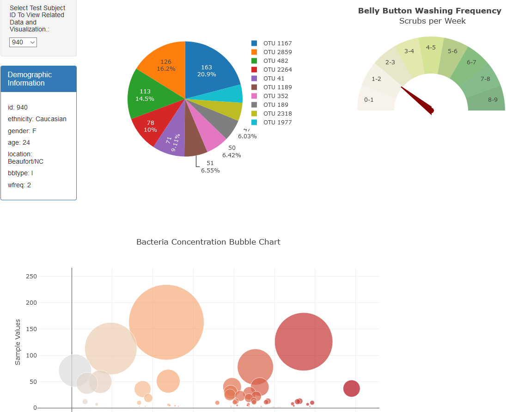
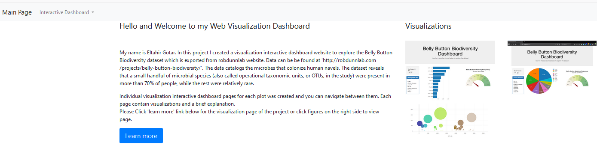

# Plot.ly - Belly Button Biodiversity

[https://gotar1.github.io/Plotly-Visualizations/index.html](https://gotar1.github.io/Plotly-Visualizations/index.html)

## Background

* In this project, we will build an interactive dashboard to explore the [Belly Button Biodiversity dataset](http://robdunnlab.com/projects/belly-button-biodiversity/), which catalogs the microbes that colonize human navels.

* The dataset reveals that a small handful of microbial species (also called operational taxonomic units, or OTUs, in the study) were present in more than 70% of people, while the rest were relatively rare.

* We are going to build a webpage with interactive charts to visualize the dataset to make more easly understood. 

* Mainly, we gonna use D3 liberary [Learn More](https://d3js.org/) and plotly [Learn More](https://plot.ly/javascript/) to create our visualizations.

## Analysis

* our task is broken into several steps:

### Step 1: Bar Chart

* Using the D3 library we created a horizontal bar chart with a dropdown menu to display the top 10 OTUs found in an individual.

 * Used `sample_values` as the values for the bar chart.

 * Used `otu_ids` as the labels for the bar chart.

 * Used `otu_labels` as the hovertext for the chart.

#### Bar Chart
  

### Step 2: bubble chart. 

* Bubble chart displays each sample.

 * Use `otu_ids` for the x values.

 * Use `sample_values` for the y values.

 * Use `sample_values` for the marker size.

 * Use `otu_ids` for the marker colors.

 * Use `otu_labels` for the text values.

### Step 3: ID selection button and demographic information.

* Display the sample metadata, i.e., an individual's demographic information.

* Update all of the plots any time that a new sample ID is selected.

### Step 4: Gauge Chart.

* Built a Gauge Chart [Learn More](https://plot.ly/javascript/gauge-charts/) to plot the weekly washing frequency of the individual.

* Gauge account for values ranging from 0 through 9.

* Update the gauge chart whenever a new sample is selected.

### Step 5: Pie Chart

* Pie chart displays each sample.

 * Use `otu_ids` for the labels.

 * Use `sample_values` for the values.

 * Use `sample_values` for the text values.

#### Pie Chart
 

## Deployment

* Project deployed to GitHub Pages [Project](https://gotar1.github.io/Plotly-Visualizations/index.html).
* Index page is an introduction to the project with links to all charts.

#### Index Page
 

## About the Data

Hulcr, J. et al.(2012) _A Jungle in There: Bacteria in Belly Buttons are Highly Diverse, but Predictable_. Retrieved from: [Data](http://robdunnlab.com/projects/belly-button-biodiversity/results-and-data/)

